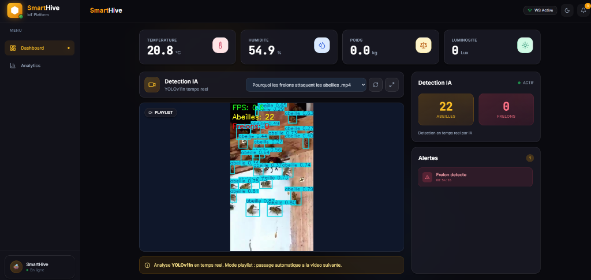

# SmartHive - Surveillance Apicole IoT & IA 🐝


[](https://www.python.org/downloads/)
[](https://kit.svelte.dev/)
[](https://github.com/ultralytics/ultralytics)

> **⚠️ État du Projet : Migration Hardware & Consolidation**
> Ce dépôt est une refonte complète du code original. La ruche est actuellement hors ligne pour une **migration majeure du matériel**.
> Nous passons d'une architecture prototype (Arduino) à une solution industrielle sur **STM32 (STMicroelectronics)** pour améliorer la fiabilité et la consommation énergétique. Le déploiement est prévu pour le printemps.

Une plateforme complète et autonome pour la surveillance de ruches, intégrant l'Internet des Objets (IoT) et l'Intelligence Artificielle pour la détection en temps réel des menaces (Frelons Asiatiques).

## Galerie

<table>
  <tr>
    <th>Dashboard Temps R?el</th>
    <th>Ruche Connect?e</th>
  </tr>
  <tr>
    <td>
      
    </td>
    <td>
      
    </td>
  </tr>
  <tr>
    <td align="center">Vue d'ensemble des m?triques</td>
    <td align="center">Prototype ruche & capteurs</td>
  </tr>
</table>

## 🔮 Roadmap Scientifique & Technique

Ce projet est vivant. Voici les axes de recherche pour la saison prochaine :

### 1. Amélioration du Dataset (In-Situ)
Le modèle actuel est robuste mais généraliste.
*   **Objectif** : Ré-entraîner YOLOv11 avec des images capturées **depuis l'intérieur de la ruche** (caméra endoscopique) et sur la planche d'envol réelle pour affiner la précision.

### 2. Analyse Acoustique (Eco-Acoustique)
Le but est de coupler la vision à l'audio pour une détection multimodale.
*   **Détection Fréquentielle** : Les frelons ont une signature sonore (battements d'ailes) très différente des abeilles.
    *   *Idée* : Utiliser le son comme "trigger" pour allumer la caméra (économie d'énergie).
*   **État de Santé** : Analyser les fréquences de la colonie (chant de la reine, bruissement d'essaimage) pour comprendre leur comportement sans ouvrir la ruche.

## 🚀 Fonctionnalités Clés

*   **Dashboard Temps Réel** : Visualisation en direct des métriques de la ruche (Température, Humidité, Poids, Luminosité).
*   **Détection IA Avancée** : Modèle YOLOv11n entraîné et optimisé pour distinguer abeilles et frelons asiatiques.
*   **Comptage & Statistiques** : Suivi des populations et alertes d'intrusion.
*   **Architecture Edge** : Optimisation NCNN/TFLite pour tourner sur Raspberry Pi avec une faible latence.
*   **Flux Vidéo Live** : Streaming MJPEG intégré avec overlay de détection.

## 🛠️ Stack Technique

### Backend & IoT
*   **Python (FastAPI)** : API REST performante et gestion des WebSockets.
*   **MQTT** : Collecte des données capteurs via LoRaWAN (The Things Network).
*   **Architecture Asynchrone** : Gestion non-bloquante des flux de données.

### Frontend
*   **SvelteKit 5** : Interface utilisateur réactive et moderne.
*   **TailwindCSS** : Design responsive et épuré.
*   **Chart.js** : Visualisation dynamique des données historiques.

### Intelligence Artificielle (Computer Vision)
*   **YOLOv11n** : Modèle de détection d'objets state-of-the-art.
*   **Quantization** : Conversion en **NCNN** et **TFLite INT8** pour performance sur Edge devices (Raspberry Pi 4).
*   **Performance** : ~5.2 FPS sur Raspberry Pi (320px input).

## 📊 Architecture du Système

Le système est conçu de manière modulaire :
1.  **Capteurs (Ruche)** : Envoi données via LoRaWAN.
2.  **Backend** : Réception MQTT, stockage CSV, diffusion WebSocket.
3.  **Vision Server** : Analyse vidéo locale, détection YOLO, envoi des comptes au backend.
4.  **Frontend** : Agrégation et affichage pour l'apiculteur.

## 💾 Installation & Démarrage

### Pré-requis
*   Python 3.9+
*   Node.js 18+

### 1. Backend (API)
```bash
cd backend
pip install -r requirements.txt
python main.py
# API accessible sur http://localhost:2000
```

### 2. Frontend (Dashboard)
```bash
cd frontend
npm install
npm run dev -- --port 2001
# Frontend accessible sur http://localhost:2001
```

### 3. AI Vision Server
```bash
cd ai-vision
pip install -r requirements.txt
python video_server.py
# Flux vidéo sur http://localhost:2002/video_feed
```

## 🧠 Méthodologie IA

Le modèle a été entraîné "from scratch" sur le dataset public [Bee-Hornet-Detect](https://universe.roboflow.com/imgprocess-n3bpn/bee-hornet-detect).
Retrouvez les détails de l'entraînement, les courbes de performance (Loss, mAP) et les modèles exportés (NCNN/TFLite) dans le dossier `ai-vision/runs`.

## 👥 Crédits

*   **Mathis** : Développement Fullstack, Architecture, Entraînement IA.
*   **Didier Orlandi** : Enseignant FabLab & Initiateur du projet. Supervision technique Hardware/IoT.

