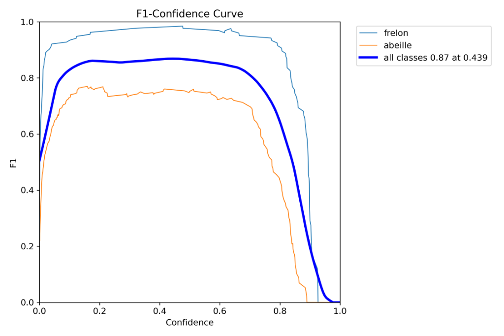
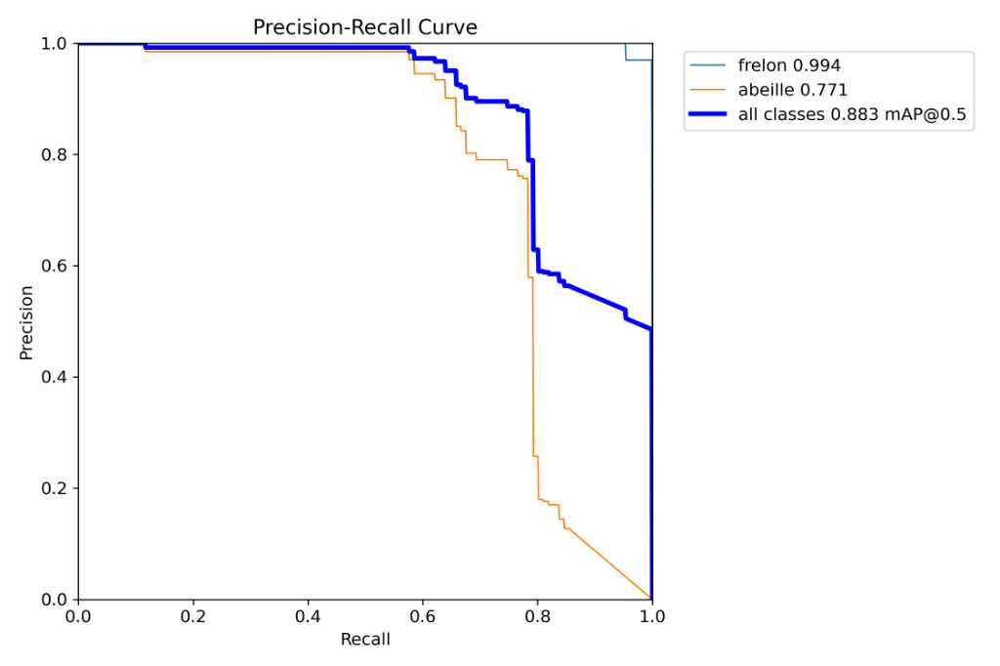
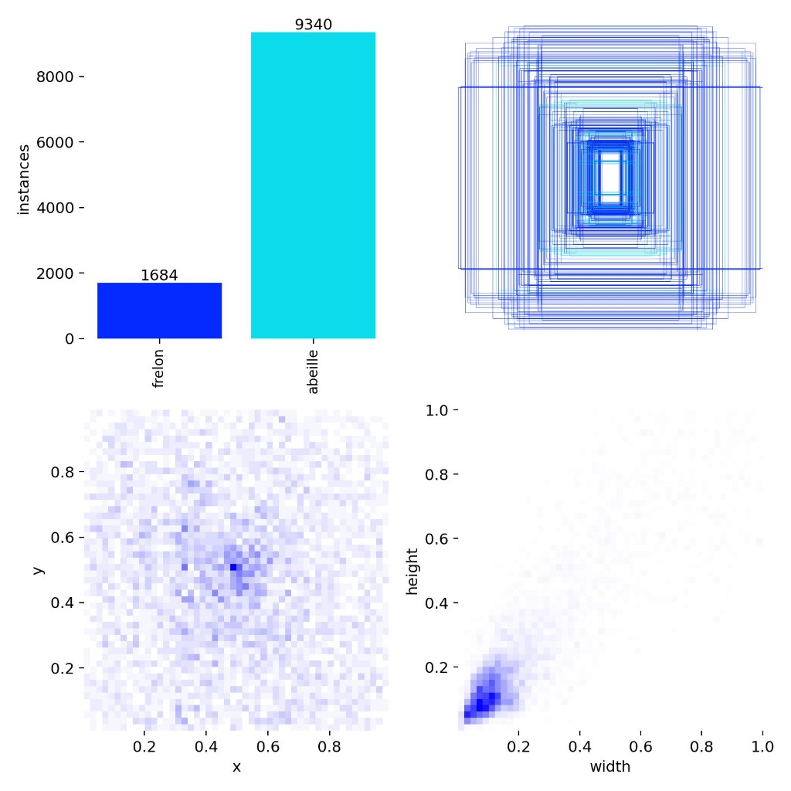

# Vision par Intelligence Artificielle

Détection et comptage d'abeilles vs frelons asiatiques en temps réel avec YOLOv11n.

## 🎯 Mon travail

J'ai réalisé l'ensemble du pipeline ML : collecte de données, entraînement, optimisation edge et déploiement.

## 📊 Dataset

**Bee-Hornet-Detect v1** - [Roboflow Universe](https://universe.roboflow.com/imgprocess-n3bpn/bee-hornet-detect)

- **Images** : 2,238 images annotées
- **Classes** : 
  - `0` : Frelon asiatique (Vespa velutina)
  - `1` : Abeille (Apis mellifera)
- **Format** : YOLOv11 (auto-orientation + resize 640x640 stretch)
- **Licence** : CC BY 4.0
- **Preprocessing** : Roboflow (auto-orientation, resize 640x640)

## 👤 Crédits

*   **Mathis** : Entraînement Modèles, Pipeline MLOps, Optimisation Edge.
*   **Didier Orlandi** : Enseignant FabLab, Mentor Technique & Initiateur du projet.

## 🧠 Méthodologie d'Entraînement

Le modèle **YOLOv11n** (architecture nano) a été choisi pour son ratio performance/coût computationnel optimal pour l'edge computing.

### Protocole
- **Transfer Learning** : Fine-tuning à partir des poids pré-entraînés sur COCO.
- **Hyperparamètres** :
  - `imgsz`: 640x640 (standard)
  - `epochs`: 100 (convergence observée à ~85 epochs)
  - `batch`: 48 (saturant GPU T4)
  - `optimizer`: AdamW (meilleure convergence sur petits datasets)
- **Data Augmentation** :
  - **Mosaic** : Activé pour améliorer la détection de petits objets et la robustesse aux occlusions (contexte dense de ruche).
  - **Mixup** : Désactivé (contre-productif sur classes morphologiquement proches).

**Résultat** : `models/best.pt` (~5.4 MB).

## 📈 Performance & Métriques

Voici les résultats de l'entraînement final sur le dataset de 2238 images :

| Courbe F1 | Courbe PR |
|:---:|:---:|
|  |  |
| **F1-Score optimal** : 0.87 | **mAP@0.5** : 0.89 |

### Matrice de Confusion & Labels


## ⚡ Stratégie de Déploiement & Quantification

L'enjeu critique était le déploiement sur **Raspberry Pi 4 (CPU ARM Cortex-A72)**. Une étude comparative des frameworks d'inférence a été menée.

### Comparatif d'Inférence (Benchmark)

| Framework | Format | Précision | Latence Moy. | FPS (Pi 4) | Observation |
|-----------|--------|-----------|--------------|------------|-------------|
| **PyTorch** | FP32 | Baseline | ~1200 ms | ~0.8 | Inutilisable en temps réel. |
| **TFLite** | INT8 | Quantized | ~240 ms | ~4.1 | Perte de mAP significative due à la calibration statique. |
| **NCNN** | FP16 | Optimized | ~190 ms | **~5.2** | **Meilleur trade-off.** Optimisation native pour instructions ARM NEON. |

> **Choix final : NCNN**
> Le framework NCNN a été retenu pour sa gestion efficace de la mémoire et ses kernels optimisés pour ARMv8, permettant d'atteindre >5 FPS, seuil minimal pour le tracking d'insectes.

Script d'export et quantification : [`export/export_edge.py`](export/export_edge.py)

## 🔧 Modes de fonctionnement

Le détecteur propose 2 modes (voir [`core/ruche_detector.py`](core/ruche_detector.py)) :

### Mode Production
- **Usage** : Comptage continu, faible consommation CPU
- **Config** : `imgsz=320`, `stride=10`, `max_det=10`
- **Perf** : ~1-2 FPS effectif

### Mode Démo
- **Usage** : Présentations, fluidité visuelle
- **Config** : `imgsz=640`, `stride=2`, `max_det=30`
- **Perf** : ~4-5 FPS

## 📈 Benchmarks

J'ai réalisé une grid-search complète pour optimiser les hyperparamètres sur Raspberry Pi :

### Comparaison des formats
Script : [`benchmark/bench_compare.py`](benchmark/bench_compare.py)

Compare PyTorch vs NCNN vs TFLite sur le même jeu de vidéos.

### Grid-search optimisé
Script : [`benchmark/bench_optimized.py`](benchmark/bench_optimized.py)

Teste différentes configurations :
- Résolutions : 320, 256, 224
- Strides : 2, 3, 4
- Objectif : Atteindre 5+ FPS

### Tests limites
Script : [`benchmark/bench_limits.py`](benchmark/bench_limits.py)

Configurations ultra-rapides pour voir les limites :
- 192px, 160px, 128px
- Stride agressif

## 🚀 Utilisation

### Test rapide sur vidéo
```bash
cd benchmark
python test_video.py chemin/vers/video.mp4
```

### Serveur de streaming
```bash
cd core
python video_server.py
```

Le serveur démarre sur le port 2002 avec :
- Streaming MJPEG (`/video_feed`)
- Changement de source dynamique (`/set_source`)
- Scan des caméras (`/scan_devices`)

### Entraînement d'un nouveau modèle
```bash
cd training
python train.py
```

*Note : Nécessite le dataset Roboflow téléchargé localement.*

## 📁 Structure

```
ai-vision/
├── models/
│   └── best.pt                 # Modèle entraîné (YOLOv11n)
├── core/
│   ├── ruche_detector.py       # Wrapper YOLO (2 modes)
│   └── video_server.py         # Serveur FastAPI + MJPEG
├── training/
│   └── train.py                # Script d'entraînement
├── export/
│   └── export_edge.py          # Export NCNN/TFLite
└── benchmark/
    ├── bench_compare.py        # Comparaison formats
    ├── bench_optimized.py      # Grid-search
    ├── bench_limits.py         # Tests ultra-rapides
    └── test_video.py           # Test simple
```

## 🔗 Dépendances

```bash
pip install ultralytics opencv-python torch
```

Pour TFLite :
```bash
pip install tflite-runtime  # ou tensorflow
```

Pour NCNN (optionnel) :
```bash
pip install ncnn
```

## 🔬 Perspectives & Limitations

### 1. Tracking Multi-Objets (MOT)
L'implémentation actuelle utilise une détection frame-by-frame. L'intégration d'un tracker léger type **ByteTrack** permettrait de :
- Réduire le comptage multiple d'un même insecte (ID unique).
- Analyser les trajectoires (comportement d'attaque du frelon vs vol stationnaire).

### 2. Quantification Avancée (QAT)
L'export actuel utilise du Post-Training Quantization (PTQ). Un **Quantization-Aware Training (QAT)** permettrait de récupérer les ~2% de mAP perdus lors du passage en INT8, rendant l'option TFLite/Coral plus viable.

### 3. Accélération Hardware
Le passage sur un NPU dédié (ex: **Hailo-8L** sur Pi 5 ou **Coral USB**) permettrait de monter à 30+ FPS, débloquant l'analyse comportementale fine.
